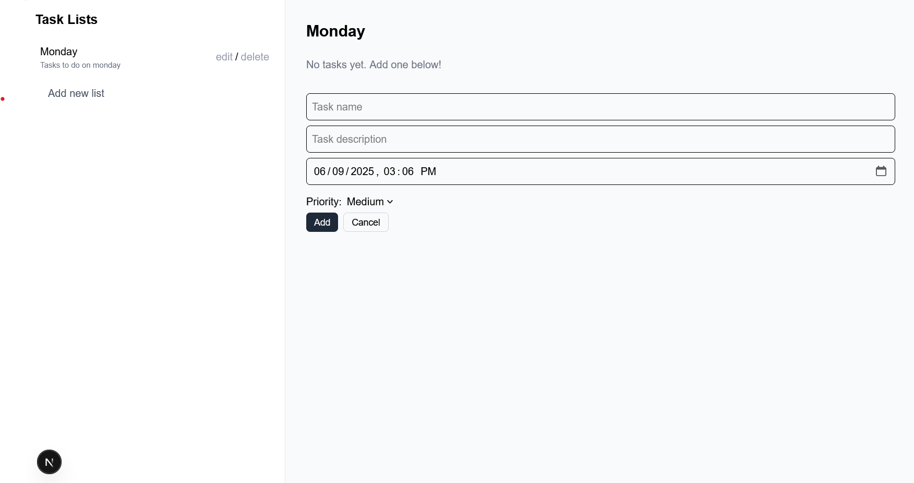
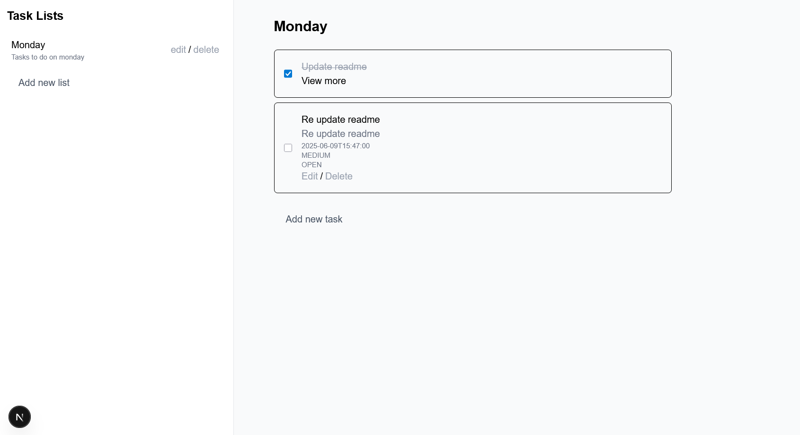

# 📝 Task Management App

## Getting Started

A full-stack Task Management application built with:

- **Frontend**: [Next.js](https://nextjs.org/) (React, Tailwind CSS)
- **Backend**: [Spring Boot](https://spring.io/projects/spring-boot) (Java)
- **Database**: [PostgreSQL](https://www.postgresql.org/)

## 🚀 Features

- Create, edit, delete task lists
- View and manage tasks within each list
- RESTful API built with Spring Boot
- PostgreSQL for persistent storage

## 📦 Setup

### 1. Clone the Repo

```bash
git clone https://github.com/Hfanes/java-tasks
cd java-tasks
```

### 2. Backend

```bash
cd tasks-backend
```

Create .env or update application.properties or application.yml:

```bash
spring.datasource.url=
spring.datasource.username=
spring.datasource.password=
spring.jpa.hibernate.ddl-auto=update
```

Run the backend:

```bash
./mvnw spring-boot:run
```

#### (Optional) Database container

Setup your docker-compose file

```bash
services:
  db:
    image: postgres:latest
    ports:
      - "5431:5431"
    restart: always
    environment:
      POSTGRES_DB: POSTGRES_DB
      POSTGRES_USER:
      POSTGRES_PASSWORD:

```

Run your database container

```bash
docker-compose up
```

API should be available at: http://localhost:8080

### 3. Frontend Setup (Next.js)

```bash
cd frontend
npm install
npm run dev
```

App runs at: http://localhost:3000

### 4. Run the Full App with Docker

Setup both Dockerfiles and run docker-compose:

```bash
docker-compose up --build
```

### 5. 🧪 API Endpoints

Task Lists

    GET /task-lists

    POST /task-lists

    GET by ID /task-lists/{taskListId}

    UPDATE /task-lists/{taskListId}

    DELETE /task-lists/{taskListId}

Tasks

    GET /task-lists/{taskListId}/tasks

    POST /task-lists/{taskListId}/tasks

    GET by ID /task-lists/{taskListId}/tasks/{taskId}

    UPDATE /task-lists/{taskListId}/tasks/{taskId}

    DELETE /task-lists/{taskListId}/tasks/{taskId}

### 4. Preview



